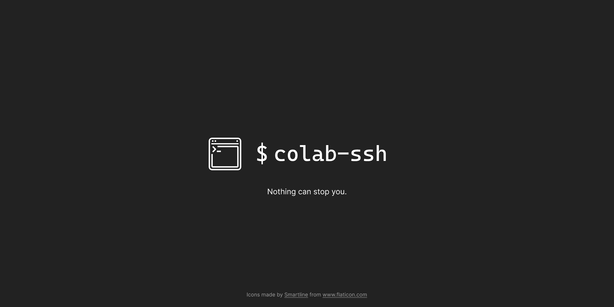
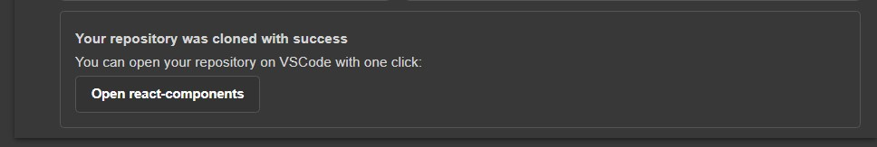

> 🎉 Happy to announce that we now support:
>  - Argo Tunnel (also known as cloudflared)
>  - VSCode direct link with which you can open your VSCode right from the notebook.

# Colab-ssh
#### Connect to Google colab via ssh easily

[](https://pepy.tech/project/colab-ssh/week)
[](https://pepy.tech/project/colab-ssh/month)
[](https://pepy.tech/project/colab-ssh)

## What is Colab-ssh ?
Colab-ssh is a light-weight library that enables you to connect to a Google Colab virtual machine using an SSH tunnel.

> <details><summary> <b> Can I open the Colab notebook automatically without user interaction ?</b> </summary>No, you still need to open the Google Colab Notebook interface manually in order to setup this tool. Google Colab doesn't have an API yet to automatically run a notebook for you.</details>

> :warning: Colab-ssh supports Google colaboratory notebooks only, using it on other notebooks may lead to unexpected behavior. 

## Getting started

1. Open Google Colab and run this code in one of the code cells
```jupyter
# Install colab_ssh on google colab
!pip install colab_ssh --upgrade

from colab_ssh import launch_ssh_cloudflared, init_git_cloudflared
launch_ssh_cloudflared(password="<PUT_YOUR_PASSWORD_HERE>")

# Optional: if you want to clone a github repository
init_git_cloudflared(githubRepositoryUrl)
```
> Make sure you replace `<PUT_YOUR_PASSWORD_HERE>` with a password of your choice and `githubRepositoryUrl` with the link to your github repository (if you use `init_git_cloudflared` function).

The output of this snippet will look similar to the following screenshot:


> :warning: If it's the first time you launch colab-ssh on your machine, it's important to follow the instructions in the **"Client machine configuration" section**. To show the steps that you need to do, **just click "Client machine configuration"**. Don't worry, you don't have to repeat these steps again for each notebook.

> :grey_question: Looking for a way to connect using Ngrok ? Check the [colab-ssh ngrok documentation](docs/ngrok/ngrok.md)


### Cloning a repository (Optional)
If you are a Github fan, you probably want to clone a repository (private or public) to the Google Colab Notebook.
This is why `init_git` is created.

##### What `init_git` does:
- Clones the repository
- Uses your personal token (if you provided it) to setup the repository remote URL (this is useful so you don't have to worry about authentication during `git clone` or `git push`). If you clone a private repository without a personal token, you will be asked to put your password.
- Checkout the branch of your preference
- Sets up the `user.email` and `user.name` for you, in case you need to commit.
- Also, it inserts the cloned folder to the `sys.path`. This is helpful when your cloned repository is a python project and you want to import some python modules directly (without specifying the name of the root folder) to your Google Colab Notebook. Example: If you cloned a repository called `example-repo`. A folder should be created containing your cloned repository. If `example-repo` has a python module called `my_module`, instead of writing in your notebook `import example-repo.my_module`, you can simply do `import my_module`.

#### Example:
```python
init_git_cloudflared("https://github.com/<OWNER>/<REPO_NAME>.git",
         personal_token="<YOUR_GITHUB_PERSONAL_TOKEN>", 
         branch="<YOUR_BRANCH>",
         email="<YOUR_EMAIL>",
         username="<YOUR_USERNAME>")
```
The output of this command will look like this:



This will display a button inside the cell output (or a url in case of a terminal). This is a direct link to open VSCode installed on your machine.
> Link doesn't appear or doesn't work?
> - Make sure you have VSCode installed locally for the link to work
> - Make sure that you run `launch_ssh_cloudflared` before `init_git_cloudflared`. The reason for that is because `init_git_cloudflared` shows the link based on the tunnel information provided by the function `launch_ssh_cloudflared`.


### Avoiding passwords (Optional)
Instead of setting a password, you can access the SSH tunnel using your own pair of keys.

> **IMPORTANT**: This feature is only available when you clone your git repository by using the function `init_git_cloudflared()`

<details><summary><b>How it works behind the scenes ?</b></summary> 
         
We get your **public key** from the repository passed into the `init_git()` function and then we add it to the  `authorized_keys` file (found in `~/.ssh` folder).
</details>

You need to follow these steps:
1. Create a pair of SSH key
2. Copy your **public key** (usually it's in the file `~/.ssh/id_rsa.pub`) and make sure you keep your **private key** in a safe place
3. In the root of your github repository, create a folder called `.colab_ssh` and a file within it called `authorized_keys`
4. Paste your **public key** inside the file `.collab_ssh/authorized_keys`
5. Push your changes to the repository and launch the clone again from your Google Colab Notebook

### Other useful documentation
- [Exposing a Google Colab environment variable](docs/expose-env-variable.md)

## API Reference
Check the API reference on this [page](docs/api-reference.md).

# Sponsor this project :)
If you want to buy me a cup of coffee, feel free to reach me or use the following IBAN (International Bank Account Number):
```
TN5904018104003696876646
```

# Contribution
Start by [opening an issue](https://github.com/WassimBenzarti/colab-ssh) so can start working together to enhance the experience of Google Colab users. We would love to hear your ideas!
